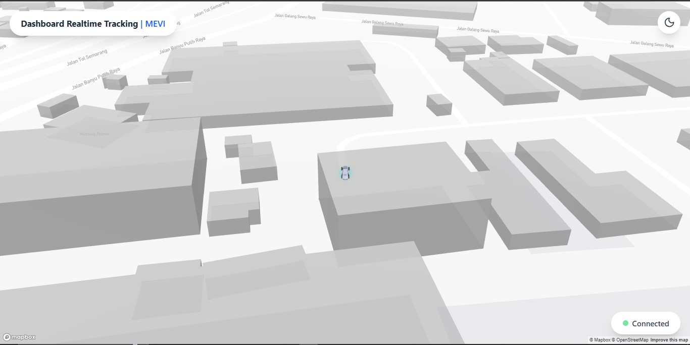

<h1 align="center">
  🚀 React + Express Fullstack Project
</h1>

<p align="center">
  
  &nbsp;&nbsp;
  
  &nbsp;&nbsp;
  
</p>

<p align="center">
  Project fullstack menggunakan <b>Node.js + Express.js</b> sebagai backend dan <b>React (Vite)</b> sebagai frontend.
</p>

---

## 📂 Struktur Project

```bash
folder-project/
├── backend/                       
│   ├── src/
│   │   └── server.ts
│   ├── .env
│   ├── package.json
│   └── tsconfig.json
│
├── public/                 
├── src/                   
│   ├── assets/
│   └── components/
└── package.json (frontend)
```

<p>⚙️ Persyaratan Awal <b>Pastikan sudah terinstall di komputer Anda :</b></p>
  <li>Node.js (Latest Version)</li>
  <li>npm atau yarn</li>

<h1>1. Cara Setup Project</h1>
<h2>a. Clone Repository</h2> 

```bash
git clone https://github.com/username/nama-repo.git
cd nama-repo
```
<h2>b. Install Dependencies Backend</h2>
<h3>Masuk ke Folder backend lalu install dependencies.</h3>

```bash
cd backend
npm install
```

<h2>b. Install Dependencies Frontend</h2>
<h3>Kembali ke root project lalu install dependensi frontend React</h3>

```bash
cd ..
npm install
```

<h1>2. Cara Menjalankan Project</h1>
<h2>a. Menjalankan Backend (Express.js)</h2> 

<p>Masuk ke dalam folder backend <b>Kemudian.</b></p>
<p>Pastikan .env terisi dengan benar, pada repo .env_example anda ubah ke .env atau mungkin anda buat salinan baru dengan nama .env</p>

<p><b>Beriku Command cara menjalankan Backnd</b></p>

```bash
cd backend
npm run dev
```
<h2>b. Menjalankan Frontend (React.Js)</h2>
<p>Pastikan anda tidak masuk ke <b>/backend</b></p>
<p>Masuk saja pada Project Folder utama anda, dan buka tab terminal baru di root project anda.</p>

```bash
npm run dev
```
Frontend akan berjalan di http://localhost:5173 (default port Vite).

<h2>Hasil Dokumentasi Ketika Berjalan</h2>


